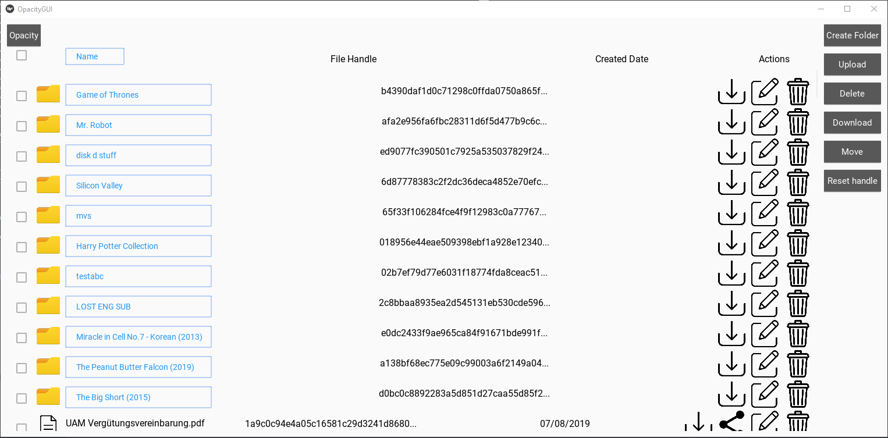

# Opacity GUI Tool

This Opacity GUI program allows you to interact with your Opacity account.

The following picture shows the current state of the fairly simple User Interface:



## Prerequisites

* Python 3
* C++ Buildtools
* OpenSSL development package

## Installation

### Windows
```
# Clone this repository
$ git clone https://github.com/Mavahu/Opacity-GUI.git

# Go into the repository
$ cd Opacity-GUI

# Create a virtual environment
$ python -m venv venv

# Activate the virtual environment
$ venv\Scripts\activate

# Install the required libraries
$ python -m pip install -r installationfiles\win-pip-requirements.txt

# Start the program
$ python OpacityGUI.py
```

## Troubleshooting

### Windows
|:exclamation: | error: Microsoft Visual C++ 14.0 is required. Get it with "Microsoft Visual C++ Build Tools": https://visualstudio.microsoft.com/downloads/ |
| ------------- | ------------- |

Follow that link and download under "Tools for Visual Studio 2019" the "Buildtools for Visual Studio 2019".
From the workloads select "C++ Buildtools" and install them.

### Linux

|:exclamation: | fatal error: gmp.h: No such file or directory |
| ------------- | ------------- |

Run the following command and try it again.
```
sudo apt install python-dev libgmp3-dev
```

### Feature-List || To-do
- [x] Basic browsing UI
- [x] File/Foulder upload
- [x] File/Folder download
- [x] File/Folder deletion
- [x] File/Folder rename
- [x] Folder creation
- [x] Sharelink creation
- [x] Handle saving/resetting
- [ ] Add file/folder moving
- [x] Implement file sorting
- [ ] Implement account-handle check
- [ ] Implement single file-handle download, if needed
- [ ] ...
